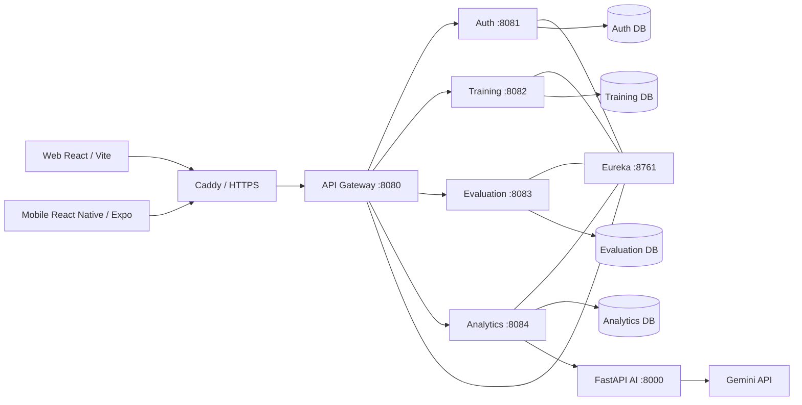

# SmartTraining AI

Plateforme LMS intelligente, multiplateforme et orientée Learning Analytics, réalisée dans le cadre d'un Projet de Fin d'Études de 5e année DLTI à l'IGA, année universitaire 2025–2026.

SmartTraining AI associe :
- une application Web React ;
- une application Mobile React Native / Expo ;
- une architecture backend en microservices Spring Boot ;
- un moteur SCORM 1.2 / 2004 ;
- un service de Machine Learning FastAPI pour la détection du risque apprenant ;
- un assistant IA génératif intégré au LMS.

## Objectif

Le projet vise à couvrir le cycle de formation au-delà d'un simple catalogue de contenus : administration, conception de formations, apprentissage, évaluations, suivi de progression, groupes, parcours, échéances, notifications, certificats, analytics, interventions pédagogiques et accompagnement assisté par IA.

## Fonctionnalités principales

### LMS
- gestion des rôles ADMIN, FORMATEUR et APPRENANT ;
- formations structurées en modules, leçons et ressources ;
- ressources texte, document, PDF, vidéo, lien externe et SCORM ;
- quiz, questions, tentatives et scores ;
- progression calculée côté serveur ;
- groupes d'apprenants et affectations collectives ;
- Learning Paths ;
- échéances, notifications et certificats.

### SCORM
- import de packages SCORM ;
- prise en charge du runtime SCORM 1.2 et SCORM 2004 ;
- persistance des données CMI, scores, temps, interactions et objectifs ;
- lecture Web et Mobile.

### Learning Analytics
- consolidation de la progression et de l'activité ;
- alertes et recommandations ;
- vue de suivi formateur ;
- feedbacks, interventions et séances d'accompagnement ;
- indicateurs BI.

### Intelligence artificielle
- modèle de classification supervisée pour le risque apprenant ;
- API FastAPI de prédiction ;
- assistant conversationnel basé sur Gemini ;
- contexte LMS autorisé et adaptation selon le rôle utilisateur.

## Architecture



Le détail des responsabilités et des flux est décrit dans [docs/ARCHITECTURE.md](docs/ARCHITECTURE.md).

## Stack technique

| Couche | Technologies principales |
|---|---|
| Backend | Java 17, Spring Boot 4.1.0, Spring Cloud, Spring Security, JPA |
| Discovery / Gateway | Netflix Eureka, Spring Cloud Gateway |
| Données | MySQL 8 |
| Web | React 19, TypeScript, Vite 8, MUI, ECharts |
| Mobile | React Native 0.85, Expo 56, Expo Router, TypeScript |
| IA | Python, FastAPI, pandas, scikit-learn, joblib |
| Assistant | Gemini API via service FastAPI |
| Déploiement | Docker, Ubuntu VPS, Caddy, HTTPS |
| Mobile Android | Expo / EAS, AAB, Google Play test fermé |

## Organisation du dépôt

```text
SmartTraining_AI/
├── README.md
├── CHANGELOG.md
├── SECURITY.md
├── docs/
│   ├── ARCHITECTURE.md
│   ├── DEPLOYMENT.md
│   ├── AI_MODEL.md
│   └── DEMO_SOUTENANCE.md
├── 04_Backend_microservices/
├── 05_Mobile_React_Native/
├── 06_Web_React/
└── 07_IA_FastAPI/
```

Les contenus générés à l'exécution (uploads SCORM, builds, caches, fichiers `.env`, AAB/APK, logs et secrets) sont volontairement exclus du dépôt.

## Démarrage local

### Prérequis
- Java 17 ;
- Maven ;
- MySQL 8 ;
- Node.js / npm ;
- Python ;
- Expo CLI via `npx`.

### Ordre recommandé

1. Eureka Discovery — port `8761`
2. Auth Service — port `8081`
3. Training Service — port `8082`
4. Evaluation Service — port `8083`
5. FastAPI AI — port `8000`
6. Analytics Service — port `8084`
7. API Gateway — port `8080`
8. Web — port `5173`
9. Mobile — port Metro distinct des ports backend

Chaque microservice Spring Boot peut être démarré depuis son dossier avec :

```powershell
mvn spring-boot:run
```

Service IA :

```powershell
cd 07_IA_FastAPI\ai-service
python -m uvicorn app.main:app --reload --host 127.0.0.1 --port 8000
```

Web :

```powershell
cd 06_Web_React\smarttraining-web
npm ci
npm run dev
```

Mobile :

```powershell
cd 05_Mobile_React_Native\smarttraining-mobile
npm ci
npx expo start --port 8086
```

Le port `8086` est proposé pour Metro afin d'éviter le conflit avec `evaluation-service` sur `8083`.

Les variables d'environnement et le déploiement sont détaillés dans [docs/DEPLOYMENT.md](docs/DEPLOYMENT.md).

## État de livraison

- Web : déployé sur l'environnement de démonstration ;
- API : déployée derrière HTTPS et API Gateway ;
- Android : version applicative `1.0.7`, `versionCode 8`, utilisée en test fermé Google Play ;
- iOS : le socle React Native / Expo est multiplateforme, mais la distribution iOS n'est pas déclarée comme une release livrée à ce stade.

## Documentation

- [Architecture](docs/ARCHITECTURE.md)
- [Déploiement et configuration](docs/DEPLOYMENT.md)
- [Modèle IA](docs/AI_MODEL.md)
- [Scénario de démonstration / soutenance](docs/DEMO_SOUTENANCE.md)
- [Backend](04_Backend_microservices/README.md)
- [Mobile](05_Mobile_React_Native/smarttraining-mobile/README.md)
- [Web](06_Web_React/smarttraining-web/README.md)
- [IA](07_IA_FastAPI/README.md)

## Sécurité

Aucun secret de production ne doit être versionné. Les mots de passe de base de données, secrets JWT, identifiants SMTP, clé Gemini et autres credentials sont injectés par variables d'environnement.

Voir [SECURITY.md](SECURITY.md).

## Statut académique

Projet de Fin d'Études — IGA — 5e année DLTI — année universitaire 2025–2026.

Ce dépôt constitue une version source assainie destinée à la traçabilité technique, à la soutenance et à la démonstration du projet. Les données runtime et secrets d'environnement ne font pas partie du dépôt.