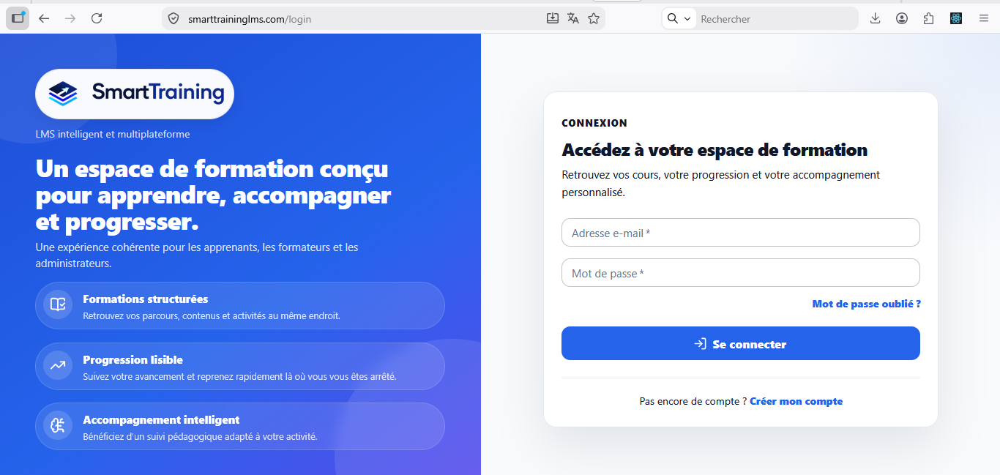
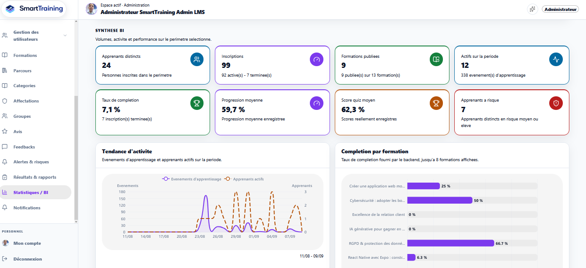
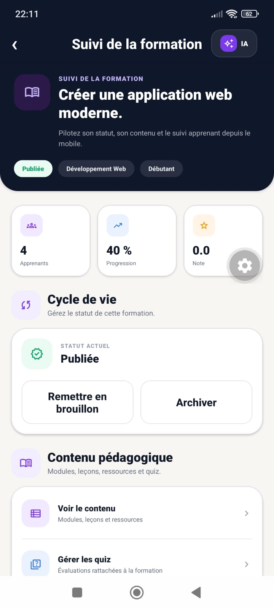
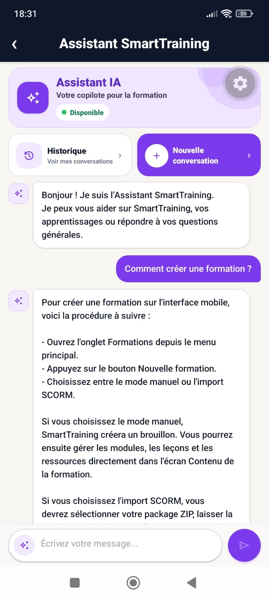
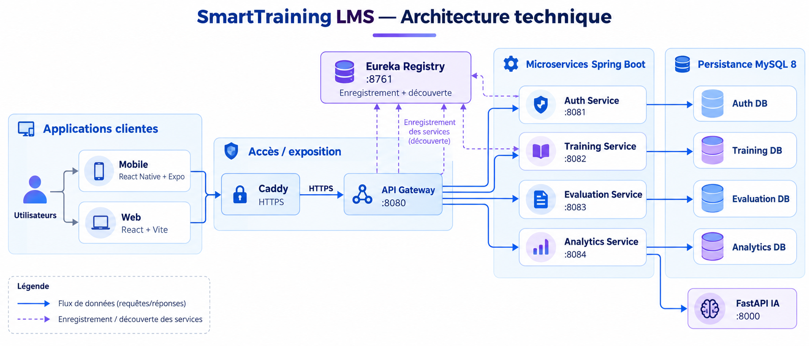

<p align="center">
  
</p>

<h1 align="center">SmartTraining LMS</h1>

<p align="center">
  <strong>Plateforme LMS intelligente, multiplateforme et orientée Learning Analytics</strong><br/>
  Projet de Fin d'Études — IGA — 5e année DLTI — 2025–2026
</p>

<p align="center">
  
  
  
  
</p>

<p align="center">
  <a href="https://github.com/saidkamel201306-dotcom/SmartTrainingLMS/actions/workflows/backend-ci.yml"></a>
  <a href="https://github.com/saidkamel201306-dotcom/SmartTrainingLMS/actions/workflows/web-ci.yml"></a>
  <a href="https://github.com/saidkamel201306-dotcom/SmartTrainingLMS/actions/workflows/mobile-ci.yml"></a>
  <a href="https://github.com/saidkamel201306-dotcom/SmartTrainingLMS/actions/workflows/ai-ci.yml"></a>
</p>

---

<div align="center">

<table align="center">
  <tr>
    <td align="center" width="25%">
      <strong>WEB</strong><br/>
      <sub>Production HTTPS</sub><br/><br/>
      ✅ Déployé
    </td>
    <td align="center" width="25%">
      <strong>ANDROID</strong><br/>
      <sub>Google Play</sub><br/><br/>
      ✅ Test fermé
    </td>
    <td align="center" width="25%">
      <strong>iOS</strong><br/>
      <sub>EAS Build</sub><br/><br/>
      ✅ Simulator build
    </td>
    <td align="center" width="25%">
      <strong>CI</strong><br/>
      <sub>GitHub Actions</sub><br/><br/>
      ✅ 4 pipelines
    </td>
  </tr>
</table>

</div>

## Aperçu produit

<p align="center"><strong>Web</strong></p>

<table align="center">
  <tr>
    <td align="center" valign="top">
      <br/>
      <sub>Connexion</sub>
    </td>
    <td align="center" valign="top">
      <br/>
      <sub>Statistiques / BI</sub>
    </td>
  </tr>
</table>

<p align="center"><strong>Mobile</strong></p>

<div align="center">

<table align="center">
  <tr>
    <td align="center" valign="top">
      <br/>
      <sub>Suivi de formation</sub>
    </td>
    <td align="center" valign="top">
      <br/>
      <sub>Assistant IA</sub>
    </td>
  </tr>
</table>

</div>

<p align="center">
  <sub>Captures réelles de la plateforme SmartTraining LMS.</sub>
</p>

## À propos
SmartTraining LMS couvre le cycle complet d'une plateforme de formation moderne : **administration, conception, apprentissage, évaluations, suivi, groupes, parcours, échéances, notifications, certificats, Learning Analytics, SCORM et intelligence artificielle**.

L'objectif du projet est de proposer une expérience cohérente sur **Web et Mobile**, avec une architecture backend découplée en microservices.

## Expérience fonctionnelle

<table>
  <tr>
    <td width="33%" valign="top">
      <h3>🎓 LMS</h3>
      <ul>
        <li>ADMIN, FORMATEUR, APPRENANT</li>
        <li>Formations, modules, leçons</li>
        <li>Ressources et quiz</li>
        <li>Progression côté serveur</li>
        <li>Groupes et affectations</li>
        <li>Learning Paths</li>
      </ul>
    </td>
    <td width="33%" valign="top">
      <h3>📊 Analytics</h3>
      <ul>
        <li>Suivi de progression</li>
        <li>Alertes et recommandations</li>
        <li>Interventions pédagogiques</li>
        <li>Indicateurs BI</li>
        <li>Analyse du risque apprenant</li>
        <li>Visualisations ECharts</li>
      </ul>
    </td>
    <td width="33%" valign="top">
      <h3>🤖 IA & SCORM</h3>
      <ul>
        <li>SCORM 1.2 / 2004</li>
        <li>Lecture Web et Mobile</li>
        <li>FastAPI Machine Learning</li>
        <li>Classification du risque</li>
        <li>Assistant Gemini</li>
        <li>Contexte LMS par rôle</li>
      </ul>
    </td>
  </tr>
</table>

---

## Architecture technique

<p align="center">
  
</p>

<p align="center">
  <sub>Vue d'ensemble de l'écosystème SmartTraining LMS : clients Web et Mobile, exposition HTTPS via Caddy, API Gateway, microservices Spring Boot, découverte Eureka, persistance MySQL et service IA FastAPI.</sub>
</p>

<p align="center">
  <a href="docs/ARCHITECTURE.md"><strong>Voir l'architecture détaillée →</strong></a>
</p>

## Stack

<p align="center">
  
  
  
  
  
  
  
  
</p>

| Couche | Technologies |
|---|---|
| **Backend** | Java 17, Spring Boot, Spring Cloud, Spring Security, JPA |
| **Gateway & Discovery** | Spring Cloud Gateway, Netflix Eureka |
| **Données** | MySQL 8 |
| **Web** | React, TypeScript, Vite, Material UI, ECharts |
| **Mobile** | React Native, Expo, Expo Router, TypeScript |
| **IA** | Python, FastAPI, pandas, scikit-learn, joblib |
| **Assistant** | Gemini via service FastAPI |
| **Production** | Docker, Ubuntu VPS, Caddy, HTTPS |
| **Qualité** | Git, GitHub, GitHub Actions |

---

## État de validation

| Brique | Validation |
|---|---|
| **Backend** | ✅ Tests Maven avec MySQL dans GitHub Actions |
| **Web** | ✅ Lint + build Vite |
| **Mobile** | ✅ Lint + TypeScript |
| **IA** | ✅ Compilation Python + test de prédiction |
| **Production Web/API** | ✅ VPS + HTTPS |
| **Android** | ✅ `1.0.7` / `versionCode 8` / Google Play test fermé |
| **iOS** | ✅ `1.0.7` / build `8` / EAS iOS Simulator build |
| **SCORM** | ✅ Web + Mobile |

> **CI : oui. CD automatique : non.**
> Le déploiement de production reste volontairement contrôlé afin de limiter les risques de régression pendant les phases de démonstration et de test.

---

## Mobile : Android & iOS

<table>
  <tr>
    <td width="50%" valign="top">
      <h3>Android</h3>
      <ul>
        <li>Package : <code>com.smarttraininglms.app</code></li>
        <li>Version : <code>1.0.7</code></li>
        <li>versionCode : <code>8</code></li>
        <li>Distribution : <strong>AAB</strong></li>
        <li>Canal : <strong>Google Play test fermé</strong></li>
      </ul>
    </td>
    <td width="50%" valign="top">
      <h3>iOS</h3>
      <ul>
        <li>Bundle : <code>com.smarttraininglms.app</code></li>
        <li>Version : <code>1.0.7</code></li>
        <li>Build : <code>8</code></li>
        <li>EAS profile : <code>ios-simulator</code></li>
        <li>Artefact : <strong>.app Simulator</strong></li>
      </ul>
    </td>
  </tr>
</table>

La publication **TestFlight / App Store** n'est pas revendiquée dans le périmètre livré. La compatibilité iOS est démontrée par un build EAS Simulator terminé avec succès.

---

## Arborescence

```text
SmartTrainingLMS/
├── README.md
├── CHANGELOG.md
├── SECURITY.md
├── docs/
│   ├── ARCHITECTURE.md
│   ├── DEPLOYMENT.md
│   ├── AI_MODEL.md
│   └── DEMO_SOUTENANCE.md
├── 04_Backend_microservices/
├── 05_Mobile_React_Native/
├── 06_Web_React/
└── 07_IA_FastAPI/
```

## Documentation

<p align="center">
  <a href="docs/ARCHITECTURE.md">Architecture</a> ·
  <a href="docs/DEPLOYMENT.md">Déploiement</a> ·
  <a href="docs/AI_MODEL.md">Modèle IA</a> ·
  <a href="docs/DEMO_SOUTENANCE.md">Démo soutenance</a> ·
  <a href="SECURITY.md">Sécurité</a>
</p>

<details>
  <summary><strong>Démarrage local</strong></summary>

### Ordre recommandé

1. Eureka Discovery — `8761`
2. Auth Service — `8081`
3. Training Service — `8082`
4. Evaluation Service — `8083`
5. FastAPI AI — `8000`
6. Analytics Service — `8084`
7. API Gateway — `8080`
8. Web — `5173`
9. Mobile — Metro sur un port distinct

### Commandes

**Backend**
```powershell
mvn spring-boot:run
```

**IA**
```powershell
cd 07_IA_FastAPI\ai-service
python -m uvicorn app.main:app --reload --host 127.0.0.1 --port 8000
```

**Web**
```powershell
cd 06_Web_React\smarttraining-web
npm ci
npm run dev
```

**Mobile**
```powershell
cd 05_Mobile_React_Native\smarttraining-mobile
npm ci
npx expo start --port 8086
```

</details>

---

<p align="center">
  <strong>SmartTraining LMS</strong><br/>
  Projet de Fin d'Études — IGA — 5e année DLTI — 2025–2026
</p>

<p align="center">
  <sub>Dépôt source assaini : les secrets, fichiers .env, builds, AAB/APK, uploads SCORM runtime et données sensibles sont exclus.</sub>
</p>
