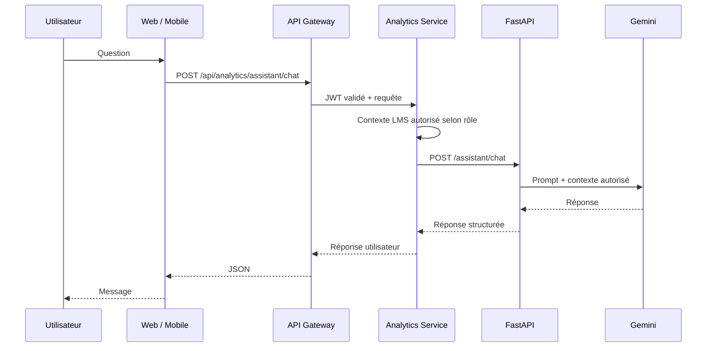

# Architecture technique

## 1. Vue d'ensemble

SmartTraining AI suit une architecture distribuée composée de clients Web et Mobile, d'une API Gateway, de microservices métier Spring Boot, d'un service IA FastAPI et de bases MySQL logiquement séparées par domaine.

Le principe central est que les clients ne portent pas la logique métier critique. Les contrôles d'accès, la progression, les évaluations, les analytics et les décisions de sécurité sont traités côté serveur.

## 2. Microservices

| Service | Port local | Responsabilité principale |
|---|---:|---|
| discovery-service | 8761 | registre Eureka et découverte des services |
| api-gateway | 8080 | point d'entrée API, routage et contrôle JWT |
| auth-service | 8081 | authentification, utilisateurs, rôles, statut des comptes, reset mot de passe |
| training-service | 8082 | formations, modules, leçons, ressources, inscriptions, groupes, parcours, certificats, SCORM |
| evaluation-service | 8083 | quiz, questions, options, tentatives et scores |
| analytics-service | 8084 | progression, événements, risques, alertes, recommandations, feedbacks, interventions, BI et assistant |
| ai-service | 8000 | prédiction ML et génération de réponses de l'assistant |

## 3. API Gateway

Les clients Web et Mobile consomment une API commune exposée par l'API Gateway.

Exemples de familles de routes :
- `/api/auth/**` → auth-service ;
- `/api/trainings/**`, `/api/modules/**`, `/api/lessons/**`, `/api/resources/**` → training-service ;
- `/api/quizzes/**`, `/api/questions/**`, `/api/attempts/**` → evaluation-service ;
- `/api/analytics/**`, `/api/progress/**`, `/api/risk-predictions/**` → analytics-service.

La route publique de l'assistant est portée par Analytics :

`POST /api/analytics/assistant/chat`

Analytics transmet ensuite la requête au service FastAPI interne :

`POST /assistant/chat`

## 4. Authentification et autorisation

L'authentification produit un JWT. La Gateway et les Resource Servers valident ce token avant l'accès aux routes protégées.

Les rôles métier principaux sont :
- `ADMIN` ;
- `FORMATEUR` ;
- `APPRENANT`.

Les permissions ne reposent pas uniquement sur l'interface : elles sont appliquées côté backend.

## 5. Données

Les domaines principaux disposent de bases logiquement séparées :
- `smarttraining_auth_db` ;
- `smarttraining_training_db` ;
- `smarttraining_evaluation_db` ;
- `smarttraining_analytics_db`.

Le moteur MySQL peut être mutualisé au niveau infrastructure, mais la séparation logique maintient le découpage métier.

## 6. Flux d'apprentissage

Un parcours apprenant typique suit le flux :

1. authentification ;
2. consultation d'une formation affectée ;
3. ouverture des modules, leçons et ressources ;
4. exécution éventuelle d'un contenu SCORM ;
5. réalisation de quiz ;
6. émission d'événements de progression ;
7. consolidation côté Analytics ;
8. calcul de risque et recommandations ;
9. consultation du suivi par le formateur.

## 7. SCORM

Le training-service gère l'import et l'exécution des packages SCORM.

Les fichiers importés et extraits sont des données runtime stockées dans un répertoire configurable (`SMARTTRAINING_UPLOAD_DIR`). Ils ne sont pas versionnés dans Git.

Le runtime prend en charge SCORM 1.2 et SCORM 2004 et persiste notamment :
- progression / statut ;
- score ;
- temps ;
- interactions ;
- objectifs ;
- valeurs CMI nécessaires à la reprise.

## 8. Intelligence artificielle prédictive

Le service FastAPI charge au démarrage un pipeline scikit-learn sérialisé avec joblib.

Analytics prépare les données utiles puis appelle le service IA. La réponse contient une probabilité / classification de risque et des informations exploitables par le suivi pédagogique.

Le modèle et ses limites sont documentés dans `docs/AI_MODEL.md`.

## 9. Assistant IA

L'assistant suit ce flux :

Le contexte LMS fourni au modèle est construit côté backend et limité aux données autorisées. La clé Gemini n'est jamais stockée dans le code source.

## 10. Observabilité

Les microservices Spring exposent Spring Boot Actuator, notamment les endpoints `health` et `info`.

Le service FastAPI expose `/health`, qui indique également si le modèle ML est chargé.

## 11. Principes de sécurité

- aucun secret dans Git ;
- JWT validé côté serveur ;
- contrôle des rôles côté backend ;
- variables d'environnement pour credentials ;
- HTTPS en production ;
- Caddy comme point d'entrée public ;
- services métier non exposés directement sur Internet ;
- uploads runtime exclus du dépôt.